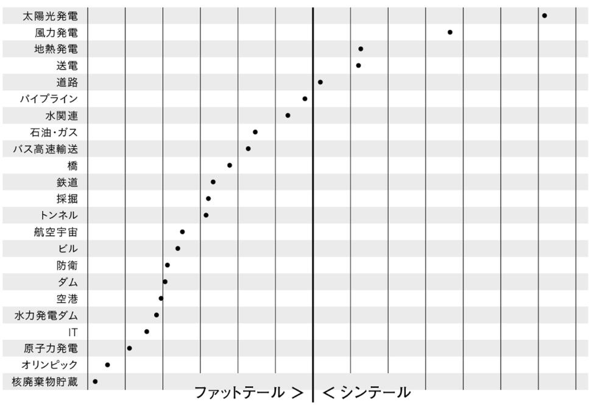

## 著者
[[ベント・フリウビヤ, ダン・ガードナー, 櫻井祐子]]
## カテゴリ
Self-Help
## 発行日
2024-04-24
## 読書開始日
2024-12-12

## 3選
 - 世界に誇る建築家のフランク・ゲーリーは、けっして答えから始めない。「私はタルムード（ユダヤ教の経典）を読んで育った」と、私が２０２１年にインタビューしたときゲーリーは語ってくれた。「タルムードは問いから始まる」。これはユダヤ教では当然のことだと彼は言う。「ユダヤ人はどんなことにも疑問を投げかけるんだ」 ゲーリーの言う「疑問を投げかける」とは、猜疑や批判ではないし、ましてや攻撃や破壊でもない。学びたいという、開かれた心を持って問いかけることだ。ひとことで言えば、「探究」にあたる。（中略）ゲーリーがするのは、問いかけだ。好奇心だけを持って、クライアントのニーズや願望、恐れなど、彼らがゲーリーのドアを叩くきっかけとなったあらゆることを聞き出している。そしてこの会話は、単純な問いから始まる。**「なぜこのプロジェクトを行うのですか？」**
 - 「経験は人に蓄積されるのであって、ものには蓄積されない。だから新しい技術を使うのは、未経験の大工を雇うのとは違って、危ういことではない」という思い込みだ。これは間違っている。実際には同じことなのだから。（中略）その結果、大会は４年ごとにくり返されるにもかかわらず、パフォーマンスは上向きの学習曲線をたどらない。オリンピックはつねに初心者によって計画、実行される。私はこの致命的な欠陥を、「永遠の初心者症候群」と呼んでいる。
 - 「小さいもので大きいものをつくる」という優美なアイデアを表す無骨な用語が、「モジュール性」だ。（中略）モジュール型のプロジェクトは、ファットテールの餌食になるリスクがずっと低い。つまりモジュール型プロジェクトは、スピード、コスト、リスクのすべての面で優位に立っている。これはきわめて重要な事実である。
## メモ
世界各地のビッグプロジェクトが如何にして失敗したかを集め，突き詰めた失敗学とも言うべき分野から生まれたビジネス書．古い事例が多いので勘違いしていたが，2024年4月に出版されたものだった．

古今東西のビッグプロジェクト，ITシステム開発や巨大建造物，オリンピック競技場，高速鉄道様々な例が出てくるが，**とにかく遅延しまくる**し，**予算も超過しまくる**．

わかりやすいところでいうと，オリンピック関連では予算超過はモントリオール五輪が当初の予算の9倍の費用がかかったという．こういうの日本だけかと思ったけど，世界中で起きているんだな．

一方で，うまくいったビッグプロジェクトの事例も挙げられる．それはエンパイア・ステート・ビルの建築だ．これは当時最高峰のビルだが，実際には非常に短い工期で作られた．これには建築家のウィリアム・ラムの手腕によるとこも大きいが，彼が取った手法が「革新的な手法の不確実性を回避するために**実績のある既成技術にこだわった**ことが挙げられる」．そして**パーツの種類と複雑性を最小限に抑え，102階建てのビルを1個建設したのではなく，1階建てのビルを102個建設した．**

この「小さいもので大きいものをつくる」性質は「モジュール性」と呼ばれる．
モジュール性のある計画では，計画内に「モジュール」と呼ばれる単位があるため，作業員がモジュール単位で反復を行うため，習熟する効果があり，工期が短くなるのだという．

次のグラフは面白い．プロジェクトの種類毎に予測と実際の工期のズレがどの程度あるかを表すと，シンテールなもの（予測と実際の差が小さい）には全てモジュール性が見られる．一方で，ファットテールなものはモジュール性を持たない一点ものであり，予測と実際の差が非常に大きくなる．

また，チームメンバーの経験が豊富であることは何よりも良いことだとこの著者は述べる．

> マスタービルダーとは、中世ヨーロッパの大聖堂を建設した、熟練した棟梁に与えられた称号だ。経験則を１つだけ選ぶとしたら、これである。 なぜならマスタービルダーは、あなたのプロジェクトの実現に必要なすべてのフロネシス（実践知）を持っているからだ。あなたのプロジェクトが住宅リフォームであれ、結婚式やＩＴシステム、高層ビルであれ、深い専門的経験を持ち、プロジェクトを成功に導いた実績のある人を雇おう。だがマスタービルダーがいない場合や雇えない場合は、次の経験則を検討してほしい。
> 
>「いくらよいアイデアでも、平凡なチームに与えたら台無しにされてしまう。だが優れたチームに平凡なアイデアを与えると、それを修正するか、もっといいアイデアを考えてくれる。だからよいチームさえ用意できれば、よいアイデアが手に入るんだ」

しかし思うに，「専門の経験」を計測するには評価側にも同じだけの専門性が必要なのではないかと思う．例えばソフトウェアエンジニアを非エンジニアが評価することは不可能であると思われる．

この経歴の真贋を判定，評価する人間をどれほど配置できるかが，良いチームビルディングに既に必要なファクターになっているのではないだろうか．

また，日本の伝統的な年功序列制企業だと，**年齢の高い中高年は「高コスト」として解雇される**という欧米とは真逆の風潮がある．
折角蓄積されてきた知識を活用させずに市場に放流し，更には「リスキリング」といったものも要求するようだ．たまったものではない．

読後感として，この辺りの疑問が強くなってきたので，次は [[日本の雇用と中高年 - 濱口桂一郎]] を読むことにした．