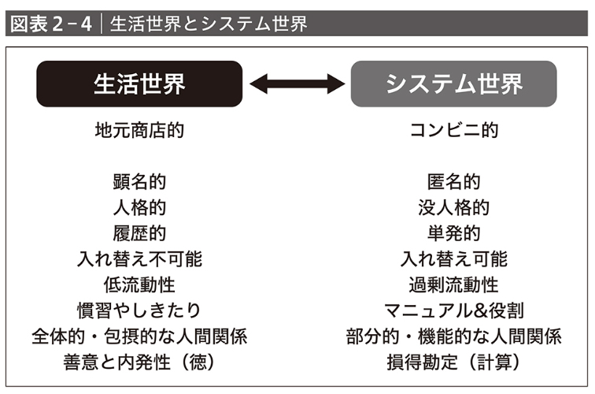

## 著者
[[宮台真司, 野田智義]]
## カテゴリ

## 発行日
2022-02
## 読書開始日
2024-05-30

## 3選
 - ユルゲン・ハーバーマスの「生活世界」と「システム世界」という二項対立．システム世界の全域化によって，テックは神格化し，人間は動物化する．感情の劣化が起こった，没人格的な人間が
   
 - われわれは「人間がこの世界をつくった」という話には耐えられない（中略）．これは「世界はどうとでもありえた」という認識に関係します．「世界の外にいる『絶対的な存在』の意思次第で世界はどうとでもありえた」という認識には耐えられても，「世界の中にいる『相対的な存在』の意思次第で世界--たとえばゲーム世界--がどうとでもありえた」という認識には耐えられない可能性があります．
 - 
## メモ

登場する映画
- [[ダーウィンの悪夢]]（フーベルト・ザウパー監督，2004）
- [[コングレス未来学会議]]（アリ・フォルマン監督，2013）
- [[エリジウム]]（ニール・ブロムカンプ監督，2013）
