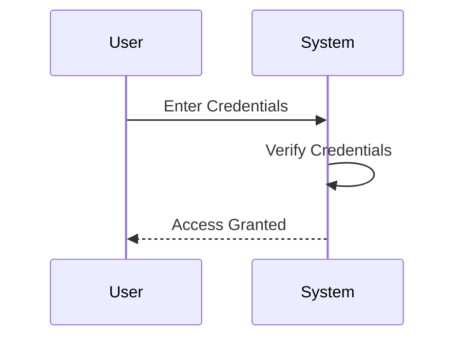
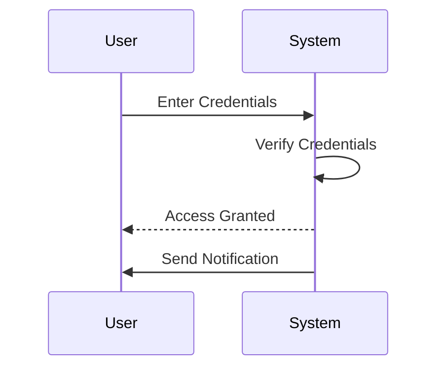
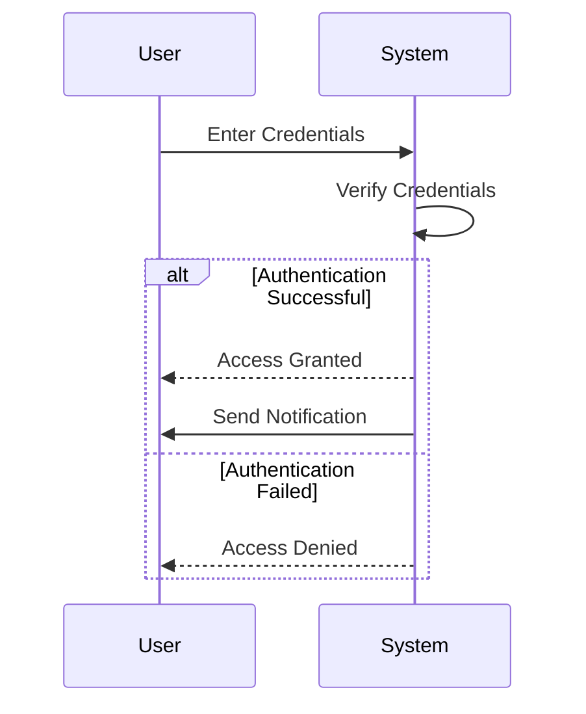

# はじめに
情報技術の進化は目覚ましく，私たちの生活に欠かせないものになりつつあります．しかし，その基礎を学ぶ「情報Ⅰ」という科目については，多くの学生がどのように勉強を進めてよいか，またどのような問題が出題されるかについて不安を感じていることでしょう．そこで今回は，最先端のAI，ChatGPTを用いて「情報Ⅰ」の予想問題を作成してみます．ちなみにGPT-4を利用しています．

# 準備
問題を予想するとはいえ何もないところから出題するわけにいきませんので，ひとまず役に立ちそうな情報Ⅰの問題を探すと，次に行き当たります．（以下「サンプル問題」）

[平成 30 年告示高等学校学習指導要領に対応した令和７年度大学入学共通テストからの出題教科・科目 - 文部科学省](https://www.mext.go.jp/content/20211014-mxt_daigakuc02-000018441_9.pdf)

サンプル問題をざっと眺めると次のような特徴が分かります．
 - 文章の穴埋め形式で出題される
 - 先生と生徒の対話型文章がベースになっていることが多い
 - 図・表・グラフを読み取る問題がある

ここから作問者の視点にたてば
「一連の文章を書き起こし，後から空欄を作り，誤答の選択肢を作る」
という手順を踏んでいそうです．
この記事では一連の文章を書き起こすことを目的とします．

次にChatGPTを利用できるかどうかを検討します．対話形式の文章を生成することはChatGPTにおいては簡単です．表はMarkdown形式などで出力できますが，問題は図やグラフです．2023/10/19にOpenAIはChatGPTでDALL-E3を使った画像生成機能を開放しましたが，これはあまりにもグラフィカルでテストにはふさわしくありません．ここでMarkdownにmermaidでグラフを描けることを思い出します．ChatGPTはmermaidの出力にも対応しているので，適宜[Mermaid Live Editor](https://mermaid-js.github.io/mermaid-live-editor/)などで確認します．

# いざ生成
では，早速，ChatGPTが作成した「情報Ⅰ」の予想問題を見ていきましょう．

## 出力結果1：データ分析
サンプル問題の第3問にサッカーの優勝チームのデータ分析があります．散布図行列，回帰直線，基本統計量，クロス集計表が出てくるので，これを参考にします．
ChatGPTが答えを生成する際時間制限があるので，問題文の長さを考えると複数回プロンプトを投げる必要がありそうです．

最初のプロンプト文は次のようになりました．
> まず，架空の県内の野球チームの過去の戦績についてダミーデータを作成してください．勝率を目的変数としてください．
次に，ストーリーを作ってみましょう．
高校生の生徒3人が話し合っています．生徒は時々間違えたことを提案し，他の生徒はそれを訂正するようにしてください．また，生徒たちの会話はそれぞれ「」で表示してください．質問の章立ては不要です．生徒の発言の前に，その前の生徒の発言をうけた返答をしてください．会話のトピックが連続するように，不自然な質問の飛躍はやめてください．
会話の内容は県内の野球チームの具体的なデータ分析についてです．各高校の勝率を回帰分析して，三人が具体的にそれぞれモデルを作ってください．三人は自分の作ったモデルの良いところを説明してください．どのモデルが最も良かったかを議論してください．表や円グラフにはMermaidを使ったMarkdownを記載してください．

これに対して，

> まず、ダミーデータを作成します。

| 学校 | 被安打 | 奪三振 | 与四死球 | 失点 | 得点 | 安打 | 本塁打 | 打率  | 盗塁 | 失策 | 完封率 | ７点差率 | 勝率  |
|------|-------|-------|--------|-----|-----|-----|-------|-------|-----|-----|-------|-------|-------|
| A    | 150   | 80    | 30     | 50  | 100 | 200 | 20    | 0.300 | 50  | 10  | 0.200 | 0.100 | 0.600 |
| B    | 160   | 70    | 40     | 60  | 90  | 180 | 15    | 0.280 | 40  | 20  | 0.180 | 0.090 | 0.550 |
| C    | 140   | 90    | 20     | 40  | 110 | 210 | 25    | 0.310 | 60  | 5   | 0.220 | 0.110 | 0.650 |
| ...  | ...   | ...   | ...    | ... | ... | ... | ...   | ...   | ... | ... | ...   | ...   | ...   |

>生徒A: 「このデータを使って、回帰分析を行ってみよう。」
生徒B: 「そうだね。各変数が勝率にどれくらい影響を与えているか見れるね。」
生徒C: 「でも、どの変数を使うべきか悩むな。全ての変数を使うとモデルが複雑になりすぎるかもしれない。」
生徒A: 「それなら、重要そうな変数だけを使ってモデルを作るのはどうかな？得点、失点、打率、本塁打は重要そうだね。」
生徒B: 「それに、変数間の相関もチェックする必要があるよ。相関が高い変数があると、多重共線性の問題が起きるから。」
生徒C: 「うん、だから各変数のペアに対する相関係数を計算して、相関が高すぎる変数は除外しよう。」
生徒A: 「それで、私は得点、失点、打率を使ってモデルを作ってみた。これらの変数は勝率と高い相関があるみたいだよ。」
生徒B: 「僕は得点、失点、打率、盗塁を使って別のモデルを作ったんだ。盗塁はチームの速さと攻撃力を示すから重要だと思う。」
生徒C: 「私は得点、失点、打率、本塁打、奪三振を使ってモデルを作成したよ。本塁打と奪三振はチームの攻撃力と守備力を示すから、これらの変数も重要だと思う。」
生徒A: 「それぞれのモデルの良い点を見つけたいね。」
生徒B: 「うん、それに各モデルの予測精度も比較しよう。」
生徒C: 「そうだね、それで最も良いモデルを選べるね。」
生徒たちはそれぞれのモデルを作成し、どの変数が勝率に最も影響を与えるか、どのモデルが最も予測精度が高いかを議論しました。そして、データ分析のプロセスを通じて、どの変数が重要で、どのようにモデルを改善できるかについてさらに理解を深めました。

最後のナレーションは不要ですが，他は殆どそのまま問題文として使えそうです．

次のプロンプト文を考えます．

> 上記の会話の懸念事項を考慮します（多重共線性，相関係数，回帰係数，予測精度）．必要に応じて架空の値を使いながら，全て具体的に計算を示して，分析を続けるストーリーを作ってください．

これに対して

> 生徒A: 「まずは各変数のペア間の相関係数を計算しよう。それで、多重共線性の問題があるかどうかを確認できるね。」
生徒B: 「そうだね、そしてその結果に基づいて、どの変数をモデルに含めるかを決定しよう。」
生徒たちはExcelを使用して相関行列を計算し、以下のような結果を得ました。

|       | 被安打 | 奪三振 | 与四死球 | 失点 | 得点 | 安打 | 本塁打 | 打率  | 盗塁 | 失策 | 完封率 | ７点差率 |
|-------|-------|-------|--------|-----|-----|-----|-------|-------|-----|-----|-------|-------|
| 被安打| 1.0   | -0.2  | 0.3    | 0.8 | -0.5| -0.3| -0.4  | -0.3  | -0.2| 0.1 | -0.6  | -0.5  |
| ...   | ...   | ...   | ...    | ... | ... | ... | ...   | ...   | ... | ... | ...   | ...   |

> 生徒C: 「見て、失点と被安打の相関が0.8で、かなり高いね。多重共線性が問題になりそうだ。」
生徒A: 「うん、それなら失点をモデルから除外しよう。そして、得点、打率、本塁打を使ってモデルを作成するのはどうだろう？」
生徒B: 「それがいいと思う。私は得点、打率、盗塁でモデルを作るよ。」
生徒C: 「私は得点、打率、本塁打、奪三振でモデルを作るね。」
それから、生徒たちはそれぞれのモデルに回帰分析を適用し、以下の結果を得ました。

|      | 生徒Aのモデル | 生徒Bのモデル | 生徒Cのモデル |
|------|-------------|-------------|-------------|
| R^2  | 0.75        | 0.72        | 0.78        |
| 得点  | 0.40        | 0.35        | 0.30        |
| 打率  | 0.25        | 0.20        | 0.25        |
| 本塁打| 0.10        | --          | 0.15        |
| 奪三振| --          | --          | 0.10        |
| 盗塁  | --          | 0.15        | --          |

> 生徒A: 「うーん、私のモデルのR^2値は0.75だ。それなりに良い予測精度だと思う。」
生徒B: 「でも、生徒CのモデルのR^2値は0.78で、少し高いね。」
生徒C: 「そうだね。でも、モデルが複雑になると、過学習のリスクがあるから、シンプルなモデルの方が実際には良いかもしれない。」
生徒A: 「それは確かに。でも、どのモデルもかなり良い予測精度を示しているね。」
生徒B: 「うん、でもこれらのモデルをさらに改善する方法はあるのかな？」
生徒C: 「もっとデータを集めたり、他の変数を考慮したりすることで、モデルを改善することができるかもしれないね。」
生徒たちはそれぞれのモデルの長所と短所について議論し、データ分析のプロセスを通じてさらに学びました。そして、どのようにしてモデルを改善し、更なる分析を進めるかについて考え続けました。

いい感じですね．具体的な数値・説明変数を記載しているので，それらを伏せることで設問を作ることが出来ます．

## 予想2:システム開発
予想問題に沿いすぎても予想にならないので，少々勇み足ですがシステム開発に関する問題文を生成させてみましょう．

> 一つのストーリーを作ってください。
二人の人が話し合っていて、途中何回かシーケンス図の設計仕様が変更されるストーリーにしてください。変更されるそのたびにシーケンス図を添付してください。シーケンス図をMarkdownで書いてください

これに対して

> もちろん、以下に改善されたストーリーを提供します。
ある日、プログラマーのアリスとボブは新しいプロジェクトの設計仕様について話し合っていました。最初に議論されたポイントは、ユーザーがシステムにログインするプロセスでした。アリスは最初のシーケンス図を提案しました。

> ボブはこのアイデアを気に入りましたが、システムがユーザーに通知を送るべきだと提案しました。アリスはその提案を受け入れ、シーケンス図を更新しました。

> 議論を進める中で、二人はエラー処理の重要性に気づきました。ボブは、認証が失敗した場合にエラーメッセージを返すようにシーケンス図をさらに更新することを提案しました。

> アリスとボブは満足して、この設計仕様をチームに提示する準備が整いました。それにより、新しいプロジェクトの基盤が固まり、二人は次のステップに進む準備ができました。

図中がなぜか英語ですが，それを日本語にして空欄にすればかなり問題っぽくなると思います．

# まとめ
「情報I」で出題されそうな問題文はChatGPTに生成させることができますし，また作問者にあっては作問補助に有用そうですね．

# 今後の課題
下記の情報も与えてあげるとより適切な作問者の姿勢を教え込むことができるかもしれません
[大学入学共通テストへの『情報Ⅰ』の導入について - 文部科学省](https://www.mext.go.jp/content/20211021-mxt_daigakuc02-000018569_3.pdf)
[高等学校学習指導要領（平成30年告示）解説 - 文部科学省](https://www.mext.go.jp/content/1407073_11_1_2.pdf)