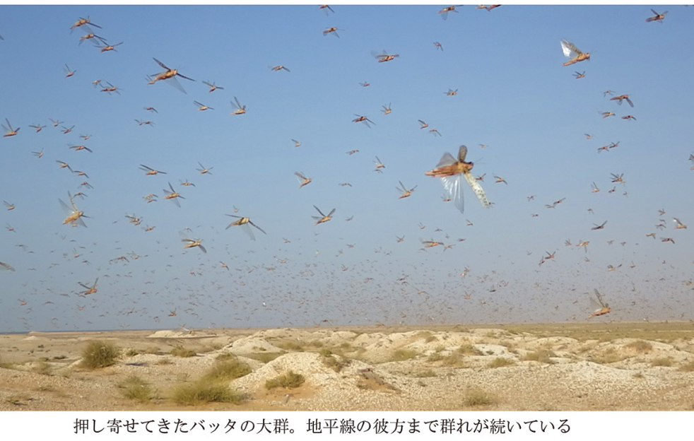

## 著者
[[前野ウルド浩太郎]]
## カテゴリ

## 発行日
2017-05
## 読書開始日
2024-05-17

## 3選
 - （日本では物乞いをする人を見かけないがモーリタニアには物乞いがおり人々が子供たちにお金や食べ物を渡しているのを見て）**救いの手を差し伸べてくれる人がいるから物乞いができるのだ**．日本の道端で物乞いをしたって，最近は物騒なので見ず知らずの他人に誰が恵んでくれようか．私は物乞いを気の毒なイメージでしかとらえていなかったが，取り巻く環境を見ると，そこには多くの優しさがあった．たんにお金がないだけで，炎天下の中，何時間も立ち続けなければならないのがいかに過酷なことか
 - モーリタニアの研究所所長「なぜ日本はコータローを支援しないんだ？こんなにヤル気があり，しかも論文もたくさんもっていて就職できないなんて．**バッタの被害が出たとき，日本政府は数億円も援助してくれるのに，なぜ日本の若い研究者には支援しないのか？** 何も数億円を支援しろと言っているわけじゃなくて，その十分の一だけでもコータローの研究費に回ったら，どれだけ進展するのか．コータローの価値をわかってないのか？」
 - モーリタニアの研究所所長「いいかコータロー．つらいときは自分よりも恵まれている人を見るな．みじめな思いをするだけだ．**つらいときこそ自分よりも恵まれていない人を見て，自分がいかに恵まれているかに感謝するんだ．嫉妬は人を狂わす**．お前は無収入になっても何も心配する必要はない．研究所は引き続きサポートするし，私は必ずお前が成功すると確信している．ただちょっと時間がかかっているだけだ」
## メモ
軽い内容の本を読もうと思って手に取った．バッタ研究をするためにはるばるアフリカに行くことになった研究者人生を面白おかしいストーリーにしてあり，読みやすかった．

著者はポスドクとしてアフリカのモーリタニアにあるバッタ研究所に赴任する．二年間の任期雇用だ．しかしバッタの大量発生は毎年あるものではない．著者はバッタの大群に出会うまで粘り，その奮闘を描く．一生分の「モーリタニア」という文字を読んだ気がする．

軽快な語り口とは裏腹に，無収入になることの精神的な疲労と社会に対する苛立ちといったものが描写される．それもそのはず，この本は[[高学歴ワーキングプア - 水月昭道]]と同じ編集者だ．

バッタの大量発生に出会えないまま二年間の任期が過ぎた頃，著者は本当に辛かったのだろう．

...本当に辛かったのか？ 疑問はあるが，これが著者の強さだろう．著者のように逆境を楽しめるような人間でないと研究者人生は送れない．

最終的に，著者はたくさんの支援者ならびに京都大学の白眉プロジェクトに通過するなどして，無事にモーリタニアでのバッタ研究を続けられるようになる．
そして遂に著者はバッタの大量発生に遭遇した．

凄まじい光景である．

「神の罰」とあるのは，この現象は古くは旧約聖書に記述のある蝗害（こうがい）と呼ばれるものだからだ．
発生メカニズムとしては本書によると飢饉が発生して天敵がいなくなった翌年に雨がふると，草木が成長してエサが豊富なところに天敵もいないため，バッタが大量に増えるのだという．
ネコやハリネズミのような雑食小動物はバッタを食べるけれども，飢饉を耐え凌いで生きられるような獣はいないのだろう… なんというかいちいちスケールの大きなアフリカ大陸だ．

著者は本書を通じて，周囲の人々の感謝に溢れており，それは無収入時代を経たために更にその思いは強くなったのだろう．

バッタ研究所所長も大変な人格者だ．彼の懐の深さと，優しさ，そして時には真剣さで著者を導いてくれる．

「つらいときこそ自分よりも恵まれていない人を見て，自分がいかに恵まれているかに感謝するんだ．嫉妬は人を狂わす」
そう言って，ペットボトルをつぶして履くしかない人達の写真を見せる．

著者のような素直な人間には，この所長のような素直な教えが当てはまったのだと分かる．
それは一部の人には全く正しい．
こういう思考は忘れてはならない．

しかし全員に当てはまるものではない，と自分は思う．

自分は客観的に見ても恵まれていると思う．
恵まれている自分ができることは今いる場所に慢心せず，さらなる高みを目指すこと．それでいて周りの苦しんでいる人に少しずつ施していくことが義務だと思っている．
これが自分なりのnoblesse obligeなのだと今も思っている．
しかし実際には恵まれているからこそ発生するトラブルといったものも存在する．
そうしたトラブルに時間もお金も取られ，本来の「高みを目指す」ことから遠ざかる．
これは他からは見えない光景だ．
また同時に迷信のようなものもある．
不幸な人に人助けをした途端，自分や周囲の人が大きな災難を被るというものだ．
恩を仇で返されるといったところだ．
自分のした行動は過ちだったのだろうか？
人を見る目がなかったのだろうか．
運気は伝染する．
付き合う人は選ばなければならない．
不幸な人からは不幸が移る．
これもまた他からは見えない光景だ．
もちろん，その手助けが本当に心の底からの手助けだったか，虚栄心はなかったか，今となっては確かに疑問もある．
これは体験した者でなくては分からない．

自分が何かを選んでいるとき自分が選ばなかった方を選ばざるを得ない人の存在を忘れてはいけない，と思った．
しかし，だからといって彼らが選べなかった方を分け与える必要は必ずしもない．
また分け与えることが偉いことの証でもない．
分け与える立場の者が偉いことの証でもない．
物事はそう単純ではないのだ．

人間は同じぐらいの「程度」の人間と集わなければならないようになっている．
嫉妬することも，虚栄を持つことも，どちらも害悪だ．

人間と幸福というのはそういうものだ．
