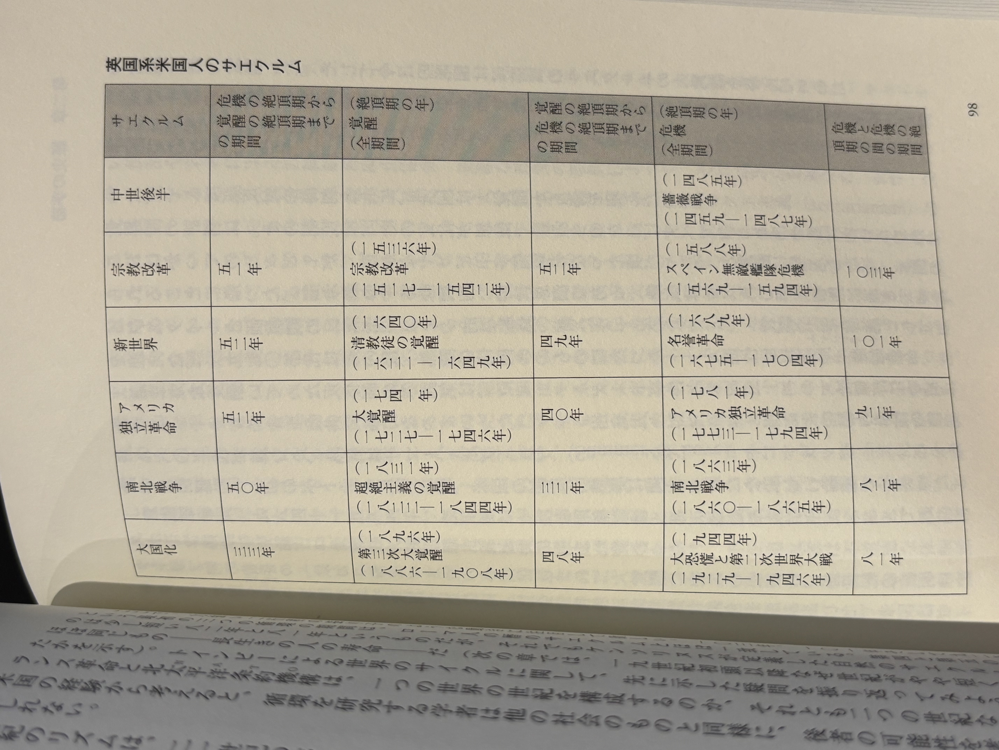

## 著者
[[ウィリアムストラウス, ニールハウ]]
## カテゴリ

## 発行日
2017-04-01
## 読書開始日
2025-09-13

## 3選
 - 
 - 
 - 
## メモ
アメリカの政治学者による政治・経済危機を予言する書．特に本書では20年おきに世代が交代し，その各世代は4つの分類がなされ，5つ目には一巡するという歴史観を紹介する．

どうして政治学者が，循環史観に興味を持ったかというと，アメリカの近現代政治史には循環する箇所が多く見られることに端を発するらしい．

著者らは古代ローマの建国をおこなった[エトルリア人](https://ja.wikipedia.org/wiki/%E3%82%A8%E3%83%88%E3%83%AB%E3%83%AA%E3%82%A2%E4%BA%BA)が暦を大事にしていたことを紹介する．

> ローマ時代のイタリアは、古代文明の中でも最も謎めいた、風変わりな文明の一つであるエトルリア（Etruria）文明の本拠地だった。エトルリア人は他のイタリア民族とは無関係で、今日のトルコにあるリュディアから来たと推測されている。エトルリア人の使っていた文字は古代ギリシャのものに似ているが、解読されていない。現代の歴史学者が彼らの宗教儀式を理解するために手がかりにできるのは、語り継がれた風説と墳墓から出土した遺物くらいしかない。これらの手がかりから歴史学者が出した結論によると、エトルリア人はまれにみる運命論者で、時代を「不可変の運命によって展開されるもの」と見ていたという。伝説によると、ある年老いた巫女の預言から、その文明が十世代しか続かないとされていた。その時に、エトルリアの命運は尽きる（finem fore nominis Etrusci）と言うのである。

人生80年というのはセネカの時代から変わらず，年相応に人間の考えは変化するので、その80年ないしは100年というサイクルで，マクロに見た時群衆の心理はその年相応の考えに支配され，それ故に歴史は循環するという．
そして，そのサイクルは世紀centuryの語源で古代ローマ建国のエトルリア人はサエクルムと呼んだ．このサエクルムという考えは何度も出てくるので，非常に多くの紙面が割かれて説明されている

> サエクルムについてわかっていることの多くは、三世紀のローマ人歴史家ケンソリヌスが伝えた、オクタヴィアヌス時代の図書館長であるマルクス・テレンティウス・ウァロの記述に由来する。衰退期に入っていた当時のローマにとって、エトルリアはすでに遠い記憶の存在となっていた。
>ケンソリヌスは、友人の誕生祝いのために描かれたエッセイである「誕生日について』（De dienatale）の中で「自然の世紀」（natural saeculae）を「生と死によって決められる、人間の命の非常に長い空間」としている。そして、エトルリア人がそれをどのように測定していたのかを説明している。
>真実は闇の中である。しかし、「自然の世紀」というものを持つ文明ならば、書籍はエトルリア人の儀式を伝えるものと見なされる。そして、「サエクルム」の起源は次のようなものだったという。**都市や文明が創立された日に誕生した者のうち、一番長生きした者が死んだ時、その死の日をもって最初のサエクルムの標準的な区切りとする。そして、その日に都市で生まれた者のうち、一番長生きした者が死んだ時に第二のサエクルムが終わるのだ。**

一番長生きしたものが死んだことをどうやって確かめるのかが謎だが，まあ寿命で定義づけられたサイクルを持っていたということだ．

> なぜローマ人はそこまでサエクルムに魅了されたのだろうか？これは100年間を都合のいい大さっぱなまとまりとして扱うための、単なる奇妙な方法だったわけではない。そもそもこれは、ケンソリヌス自身がそれについて取り上げたうえで否定している。
> 彼によれば、ローマ人には常に「暦の世紀（civil saeculum）」（厳密に100年間の時間単位）と「自然の世紀（natural saeculum）」（生活や歴史上の出来事、帝国の運命）の区別が付いていたというのだ。より精度の高い説明としては、ローマ人は歴史を通じて脈打っていた、80年から110年間の強いリズムに感銘を受けていたというものだ。

古代人も馬鹿ではない．現代の centry が表すところの厳密な100年とサエクルムのサイクルは区別がついていたという．

> なぜサエクルムはここまで特殊なものになるのだろう？一つには恐らく人間の生命の期間が、人類が避けることも変えることもできない唯一の循環だからだろう。光や熱、そして降水といった地上の変動は、現代の技術や国際市場によって変化させたり出し抜くこともできる。王朝の交代という政治の変動も、イデオロギーや国民国家によりねじ曲げることや止めることが可能だ。人間の生命のサイクルと季節は、現在も比較的変わっていない。
> しかし、より重要な理由は、現代人が自由な意志の下に自然や社会の環境を新たに形づくろうとする時に起こるものだ（時間の循環から逃れようとする時が多く見られる）。こうした時、現代人の世界を変えようとする活気は、自分自身の人生における経験を反映することが多い。たとえば若い頃に平和（または戦争、正義、芸術、富、神聖さ）への希求を刻み込まれた現在の世代が指導層になると、彼らは社会をそのような方向に変える権力を持つ。その後の新たな世代は、その方向性を逆転させようとするかもしれない。寿命のリズムにあった歴史に、活力を与えようとするのだ。このように人生の循環から解放されようとすると、世紀（saecular）のリズムをつくり出す際に大きな皮肉を生むことになる

サエクルムの特殊性は，人間の寿命が古代から変わっていないことを挙げる．セネカの時代から人生3万日=82年と言われてきた（平均寿命が短かったのは奴隷などを含めた「平均」だったからだ）

そして，その年相応のリズムとは

- 幼年期（プエリティア•～二〇歳）社会的役割：成長（養育を受け、価値観を身につける）
- 成人期（ユベンタス二一～四一歳）社会的役割：活力（組織制度に仕え、価値観を吟味する）
- 中年期（ビリリタス四二～六二歳）社会的役割：権力（組織制度を管理し、価値観を用いる）
- 老年期（セネクタス六三〜八三歳）社会的役割：指導者（組織制度を指導し、価値観を受け渡す）
- 晩期老年期（八四歳～）社会的役割：依存（組織制度から慰安を受け、価値観を記憶する）

のように，幼年期〜老年期をサイクルとして，それよりも長生きした者は 晩期老年期 に含めていたようだ．

この一部の具体例として，戦争が発生するメカニズムを次のように説明できる．

> 第二次世界大戦の直後にアーノルド・トインビーは、自らが論じた戦争の循環の根底にある「自然的世代循環」（Physical Generation Cycle）を記した。これは実際のところ、世代の種類についての理論であった。彼は大戦争が周期的に発生する理由を、戦争が異なった年齢の人間にもたらす効果のせいだとしている。ある大戦争で兵士であった若者は、後に高齢の指導者として戦争を振り返り、新たな戦争の布告を慎む。そして最初の大戦争の記憶がまったくない者が、次の大戦争を布告するのだ。
> 戦争を戦う者と布告するものの間に過渡期の世代を挿入すれば、トインビーの循環一つ分の間にまたがる、四種類の循環期ができる。

また成人期から中年期への移行が気になるが，そこはアリストテレスの引用も含めて著者は次のように説明する．

> 中年期が始まるのは何時だろう？多くの権威ある人（ブラウン、オルテガ、ユング、レビンソン）によると、四〇歳から四五歳の間のいずれかの時点で始まるという。アリストテレスは、人は肉体的な頂点に三五歳で達し、精神的な頂点は四九歳だと記している。

サエクルムに関するよくある誤解として，予言には使えないというものがある．

> 真珠湾への奇襲攻撃は？ウォーターゲート事件の住居侵入は？マイクロコンピュータの発明は？どうやったら社会変化についての理論で、こうした物事を予言できるのだろうか？
>答えは簡単だ。サエクルムは、そうした物事を予言もしないし、排除もしない。そう、歴史は常に事件を惜しみなく提供する。しかしサエクルムにとって一番大切なのは、事件そのものではなく、その事件に対する社会の反応のほうなのだ。その仕組みを理解するには、事件を一つ選び、他の時代に移し替えてみればいい。そして、その影響を再現してみるのだ。ウォーターゲートホテルへの住居侵入事件を四〇年前にさかのぼらせてみよう。一九三四年頃の米国は、圧倒的大差で当選したばかりの「伝道師の世代」の大統領を必死になって辞任に追い込もうとする兵士の世代の二人の記者を受け入れただろうか？もちろん、そんなことはない。また大恐慌がその四〇年後に発生したとしょう。一九七四年頃のベビーブーマーの世代が経済崩壊に対応するために、喜んで制服を着て、準軍事的な公共事業計画に参加し、テネシー川流域にダムを建設しただろうか？こちらも、ありそうにない。

とにかく，その寿命というリズムに基づいて社会は動かされ，歴史は刻まれるのだとする．

---

> 一つの月が終わると、日付は一日に戻る。一つの年が終わると、一月に戻る。しかし年を元年に戻さなければならない時はあるだろうか？古代人はあると考えた。壮大なことや預言にあるようなことが起こった時、すべての時間の目盛りを最初に戻すことが多かった。暦の日付は、特定の御代や世代、王朝の下での年数で表されるのが普通だった。多くの近代宗教（キリスト教、ユダヤ教やイスラム教）は、一方向に同じ速さで進む年の考え方と堅く結びついているので、定期的に新たに時間を始める考え方にはなじめない。

1日は24時間で、1月は30日で、1年は365日なのに、年だけが繰り返さないというのを初めて聞いた小学生の時、私は強い違和感を感じた．

そして，我々東洋人には古くから干支という考え方があり12年で一巡することは馴染みのある考え方であるが，どうやら啓典の民にはそのような循環的な歴史観はものすごく新しく見えるものらしい．

---

さて，ここで著者らの世代循環の説を紹介する

>- 第一の節目は「高揚」(High) 制度が強まって個人主義が弱まる上昇的な時代。新しい社会秩序が、浸透して、古い価値による制度が崩壊していく。
>- 第二の節目は「覚理」（Awakening）：精神面での変が起こる情熱的な時代。既存の社会秩序が、新しい価値観による制度から挑戦を受けるようになる。
>- 第三の節目は「分解」（Unraveling）：個人主義が強化されて制度が弱まる下降的な時代。古い社会秩序は衰退して、新しい価値観による制度が植え付けられる。
>- 第四の節目は「危機」（Crisis）：社会が微動を迎える決定的な時代。古い価値観が新しいものと代わり、社会秩序の変化を推進することになる。

>- 「預言者」世代は「高揚」時代に生まれる。
>- 「遊牧民」世代は「覚醒」時代に生まれる。
>- 「英雄」世代は「分解」時代に生まれる。
>- 「芸術家」世代は「危機」時代に生まれる。

これは具体的にはラシュモア山に刻まれている偉人たちがその代表者らしい

> ラシュモア山の花崗岩に刻まれているのは、ジョージ・ワシントン、トーマス・ジェファーソン、セオドア・ルーズベルト、そしてエイブラハム・リンカーンという四人の偉大な米国の指導者のモニユメントである。彼らの生れた年は一二六年も離れていて、四つの異なる世代（自由、民主共和派、革新主義者、そして超絶主義）を代表している。しかしラシュモア山には、それ以上の意味がある。
>
> それらは各原型のうち、最も有名な大統領であることを永遠に証言するモニュメントだからだ。
>
> ではそれらを左から右に眺めてみよう。それらが刻まれている順番は、年代順ではなく、世紀の順だ。遊牧民、英雄、芸術家、そして預言者である。ラシュモア山へ彫刻を施したガットスン・ボーグラムの狙いは、「原型の神話に再び力を与えることにあった。

これらの人々がどのように節目を生むかというと

>- 最初の節目は高揚である。老人の預言者が消え、遊牧民が老年期に達する。英雄は中年になり、芸術家が若い成人期に達する。そして新たな世代である預言者が子供として誕生する。
>- 二番目の範目は覚醒である。老人の遊牧民が増え、英雄が老年期に達する。芸術家が中年になり、預言者は若い成人期に達する。そして新たな世代である遊牧民が子供として誕生する。
>- 三番目の節目は分解である。老人の英雄が消え、芸術家が老年期に達する。預言者が中年になり、遊牧民は若い成人期に達する。そして新たな世代である英雄が子供として誕生する。
>- 四番目の前目は危機である。老人の芸術家が潤え、預言者が老年期に達する。遊牧民が中年になり、英雄は若い成人期に達する。そして新たな世代である芸術家が子供として誕生する。

これらを具体的に歴史に当てはめ，表にすると次のようになる．

> 米国ではほぼ同時期に、ハーバード大の政治学教授である[[サミュエル・ハンティントン]]が、自分が世代間のギャップを受けとめる側にいることに気がついていた。そのギャップにより、自分たち兵士世代の教員は放なベビーブーマー世代を相手にしなければならなかったからである。それに対する彼の対応は、四つの部分からなり繰り返される、II循環（制度と観念＝ Institutions versus Ideals）を定義することだった。これは制度の成長と価値観の成長の時期が、一七七〇年代から一九六〇年代までの二世紀にわたり交互に続いてきたというものだった。**ハンティントンの周期は、本書で提唱するサエクルムと一致する**。彼は世代の形式論をはっきり特定していなかったが、彼が意図したものは明らかだ。最初の世代は制度をつくる。第二の世代は、その制度を完成させるとともに、自己の道義的失敗を知るようになる（ハンティントンが“善”と呼ぶ態度である）。第三の世代は、新たな観念を提議し、第四の世代は、その観念を試すとともに、実践での失敗を悟る（ハンティントンが“冷笑”と呼ぶ態度だ）。

ハンティントンも周期性に言及していたそうだ．

そして現代は「危機」に向かっているというが，この本の出版は1995年なので，30年前である．確かに，リーマン・ショックがあり，ウクライナ侵攻があったが，何か大きな危機が来るのはまだこれから…という感じがする

----

> 難題から救われるというのは、達成感を奪われるということでもある。帝国初期のローマのマナーについての批評の中で、偉大な歴史家であるタキトウスは、「偉大な社会の市民の美徳は一方向にしか変化しない」と主張する倫理学者たちに反対した。彼は、「実際のところ、人に関することには一種の循環があると言っていいかもしれない・・・・・・そして、倫理は季節のように変化する。必ずしも古代のほうが良かったということではない。われわれの世代も、子孫が学ぶべき名誉と教養に富んだ振る舞いの事例を多く産み出している。こうした先祖との賞賛すべき競争が、永遠に続くことを望むべきだ」と記している。タキトウスから2000年後のいま、われわれも彼と同じ希望を持つべきであろう。

結びとして，著者はタキトゥスの言葉を引用している．
「倫理は季節のように変化する」とても面白い示唆である．