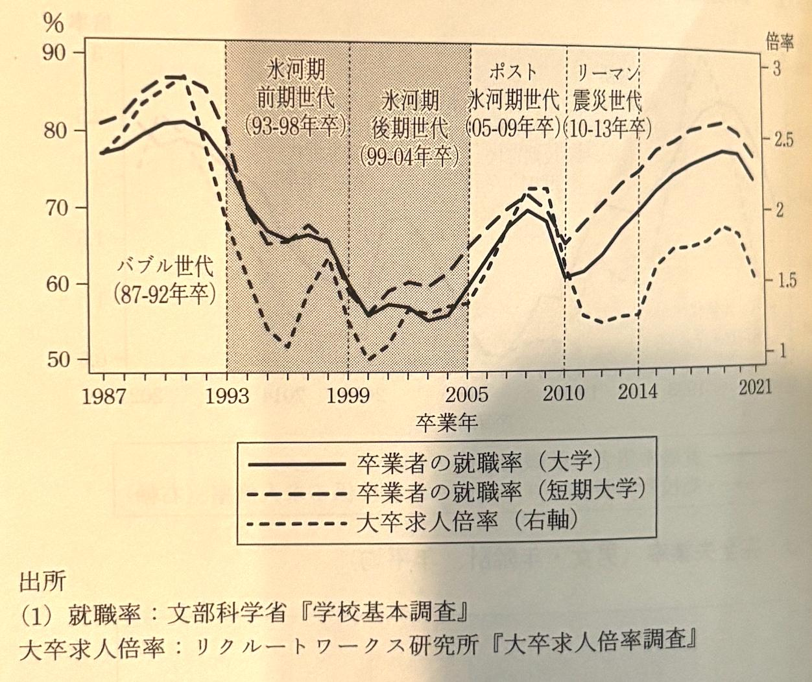
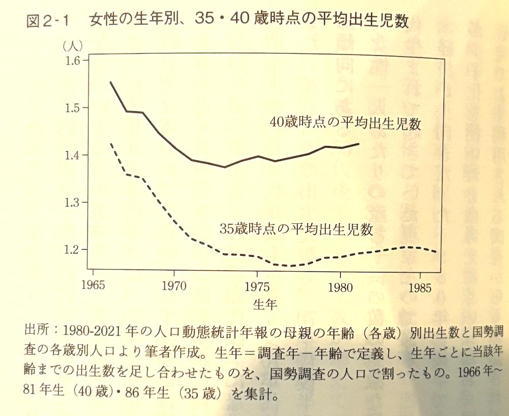

## 著者
[[近藤絢子]]
## カテゴリ
labor economics
## 発行日
2024-10-24
## 読書開始日
2024-12-24

## 3選
 - 氷河期世代よりも下の世代は、景気回復期の卒業した世代も含めて雇用が不安定で年収が低いままである。氷河期世代よりも下の世代は、景気回復期の卒業した世代も含めて雇用が不安定で年収が低いままである。氷河期世代を境に、就職した年の景気の長期的な影響（瑕疵効果）が弱まった。
 - 2000年代以降、雇用状況が悪くなると翌年の出生率が下がるという、景気と出生率の間の正の相関が観察されるようになった。つまり現在の経済状況が厳しいと、今すぐに子供を作るのは控えようとする傾向がある．氷河期後期世代にあたる1970年代後半〜80年代前半生まれは、そのすぐ上の団塊ジュニア世代よりも、40歳までに産む子供の数は実は多かった。個人レベルで見ると若年期の雇用が不安定だと、男性だけでなく女性でも、結婚確率や子供の数は減る
 - 就職氷河期のインパクト自体に地域差があった．地域間の賃金格差は就職氷河期に拡大し、特にフルタイム雇用者で顕著だった。18歳時点の地域間移動自体は減少傾向にあるが、その時の居住地が他の地域に比べて相対的に景気が悪いと、他地域進学も他の都道府就職も増える
## メモ



就職氷河期世代（1993-2004年に卒業した人々）について書かれた本．この世代はその上の世代であるバブル世代（87-92年卒）と大きく様子異なることからこれまでもメディアで大きく取り沙汰されてきた．
しかし，その多くは各論ルポルタージュに収束することが多く，世代としてデータから見つめるという取り組みをこの本は意欲的にも挑戦している．データで見ると，いくつかの新しい発見があった．

まず，氷河期世代よりも下の世代は，景気回復期（ポスト氷河期世代：2005-2008年卒；リーマンショック年まで）を含めて，雇用が不安定で年収が低いままであるという指摘だ．就職氷河期世代「だけ」ではなく，就職氷河期世代「以降」で，雇用が不安定で年収が低いままであるということを詳らかにした．

また，正規雇用，その中でも従業員300人以上の大企業かどうかについての割合も氷河期世代の落ち込みは激しく，特に高卒の下落幅が大きい．


次に，出生率との関係を見ていくと．実は1970年代前半から1980年代までの平均出生児数は若干増加傾向にある．これはデータを見て分かったことで，本書でも筆者は意外な結果として取り上げている．（後期）氷河期世代はその上の団塊ジュニア世代よりも子どもを生んでいるのだ．



次に興味深いのは，都道府県別出生率と有効求人倍率の関係だ．

> 2000年代以降、雇用状況が悪くなると翌年の出生率が下がるという、景気と出生率の間の正の相関が観察されるようになった。


有効求人倍率が0.1あがれば，出生率は0.039上がるということになる．これは凄く大事なことで，有効求人倍率，すなわち活力ある企業が増えて人材投資しようという企業が増えれば少子化を食い止められる可能性があると読める．なぜなら逆に，出生率が上がったことを原因に企業が有効求人倍率を上げようとは直感的に考えてもありえないからだ．

三点目は，就職氷河期のインパクト自体に地域差があった，ということだ．次の図は，近畿圏出身者には衝撃である．どの図においても近畿圏は東海地方や首都圏に大きく劣っていることが分かる．東海地方は製造業が強く，高卒の年収は高い．しかし，その彼らの氷河期世代の正規雇用率は近畿圏よりも良かったりする．大卒平均年収・フルタイム雇用者の年収は顕著である．首都圏がリードしているのは当然としても，大卒後期氷河期世代から平均年収は近畿地方は東海地方に大きく水をあけられてしまった．


以上が，この本で得られた趣旨・知見であるが，この本のまとめとしては，[[日本の雇用と中高年 - 濱口桂一郎]]と同様，政府の社会保障制度の少なさ，再分配の少なさをあげている．

> 就業はしているが所得が十分でない者に対する再分配がほとんどない。高齢でもなく障得もない場合、生活保護以外の制度がないのだ。非正規雇用から失業した場合、雇用保険の失業給付金も十分にはもらえないことが多い（酒井2020）。2011年より地行されている求職者支援法は、この点の緩和を目指したものであるが、あくまで職業訓練の受講を容易にするための制度であり生活保障として十分とは言えない。生活保護基準にはぎりぎり入らないような、最貧困層のすぐ上の所得階層にいる現役世代に対するセーフティネットが薄い。このことは、2000年代に「ワーキングプア」という言葉が流行した時にすでに指摘されていたが、この20年でほとんど改善されていない。

対応策としては，

> 例えば、欧米では実際に導入され、一時期日本でも盛んに議論されていた給付付き税額控除、いわゆる「負の所得税」は、一定以下の所得の人に対して、労働所得に比例した給付を行うものだ。必ずしも給付付き税額控除が最適な形式であるとは限らないが、既存の制度の枠にとらわれない発想で議論を深めていく必要があるだろう。

と結論付けている．

[負の所得税](https://ja.wikipedia.org/wiki/%E8%B2%A0%E3%81%AE%E6%89%80%E5%BE%97%E7%A8%8E)というのは，

> 負の所得税において、ある所得レベルの人々は課税されない。また、そのレベルを上回る所得のある者は、そのレベルを超える所得の一定割を支払う。そして、そのレベルを下回る者は、不足分すなわち所得がそのレベルを下回っている額の**一定割の給付**を受ける

政策のことで，過去の欧米での実験では次のような結果になったという（ChatGPT調べ）

```
結果は混在していました。
**アメリカの実験**
ニュージャージー州などで行われた「負の所得税」実験では、以下の結果が得られました：
1. **所得の安定化**：低所得者の生活水準は改善されました。
2. **労働供給の減少**：一部の受給者で労働時間が若干減少しましたが、大幅な離職にはつながりませんでした。特に女性や主婦層で労働時間の減少が見られました。
3. **行政コスト**：制度の管理と運営に一定のコストがかかり、普及には課題が残りました。

**アラスカの永久基金配当**
アラスカ州では以下の結果が観察されています：
1. **経済的恩恵**：所得格差の縮小に寄与しました。
2. **労働影響は小さい**：配当金が比較的小額であるため、労働意欲への影響は限定的でした。

**イギリスのUniversal Credit**
1. **柔軟性向上**：低所得者が働くインセンティブを保ちながら支援を受けられる。
2. **導入課題**：管理の複雑さや導入初期の遅延が問題視されました。

**総括**
「負の所得税」は所得格差の縮小に効果的である一方、制度設計によって労働意欲や財政負担に異なる影響を及ぼすことが分かっています。
```

制度設計の難しさを知る結果となったようだ．ベーシック・インカムなどの議論とも合わせて，検討していく必要があるだろう．

